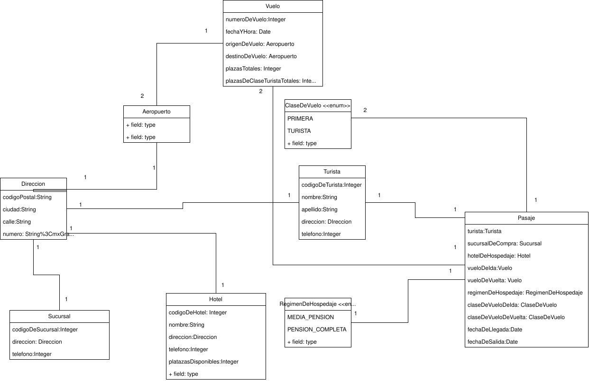

link del repositorio: https://github.com/PatricioRios/parcial-1-paradigmas-3

link del diagrama: https://drive.google.com/file/d/1LR4_U5UsDeDs5N_p1rsymFhCVQ9LEyec/view?usp=sharing

Alumnos:
- Reynoso Rios Nestor Patricio - 44329343
- Matias Emmanuel puyo - 34328636

## diagrama:

